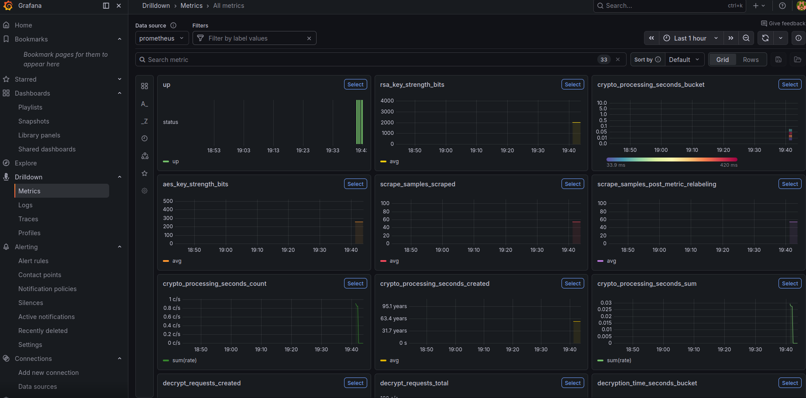

# 🔐 Secure Chat & Encryption Microservices


A **Dockerized encryption/decryption system** built using **React, FastAPI, and Docker**. This project demonstrates **hybrid AES/RSA encryption**, metrics collection with **Prometheus/Grafana**, and automated load testing for cryptographic operations.

---

## 📌 Table of Contents

* [Features](#features)
* [Tech Stack](#tech-stack)
* [Getting Started](#getting-started)
* [Services](#services)
* [Metrics & Monitoring](#metrics--monitoring)
* [Automated Load Testing](#automated-load-testing)
* [Future Improvements](#future-improvements)

---

## ✨ Features

* **Frontend** using React & Bootstrap
* **Hybrid encryption** with AES for messages and RSA for key exchange
* **Separate microservices** for key management, encryption, and decryption
* **Prometheus metrics** for:

  * Encryption & decryption requests
  * Processing time
  * Key strength (AES & RSA)
  * Computational overhead
* **Grafana dashboard** to visualize crypto metrics
* **Dockerized setup** for reproducible deployment
* **Load testing** to simulate multiple encryption/decryption requests

---

**Highlights:**

* Frontend communicates via **Docker service names** (`http://key-service:8000`)
* **AES session key** encrypts messages; **RSA keys** encrypt/decrypt AES key
* Metrics exposed via `/metrics` for Prometheus scraping
* Load tester automates requests for performance measurement

---

## 🛠 Tech Stack

| Component               | Technology                             |
| ----------------------- | -------------------------------------- |
| Frontend                | React, Bootstrap                    |
| Backend / Microservices | FastAPI, Python, PyCryptodome          |
| Containerization        | Docker, Docker Compose                 |
| Monitoring & Metrics    | Prometheus, Grafana                    |
| Testing / Load          | Python `requests` + ThreadPoolExecutor |

---

## 🚀 Getting Started

1. **Clone the repository**

```bash
git clone https://github.com/te70/supreme-umbrella.git
cd secure-chat
```

2. **Create RSA keys**

```bash
mkdir keys
openssl genrsa -out keys/private.pem 2048
openssl rsa -in keys/private.pem -pubout -out keys/public.pem
```

3. **Start all services with Docker Compose**

```bash
docker compose up --build
```

4. **Frontend**

* Visit [http://localhost:5173](http://localhost:5173)
* Type a message → click **Encrypt** → see ciphertext
* Paste ciphertext JSON → click **Decrypt** → see plaintext

---

## 🖥 Services

| Service           | Description                                              |
| ----------------- | -------------------------------------------------------- |
| `key-service`     | Handles encryption using AES + RSA. Endpoint: `/encrypt` |
| `session-service` | Handles decryption. Endpoint: `/decrypt`                 |
| `client`          | React frontend                                           |
| `load-tester`     | Automates requests for performance testing               |
| `prometheus`      | Scrapes metrics from `metrics-service`                   |
| `grafana`         | Visualizes metrics in dashboards                         |

---

## 📊 Metrics & Monitoring

Metrics collected:

* `encrypt_requests_total` – Total encryption requests
* `decrypt_requests_total` – Total decryption requests
* `encryption_time_seconds` – Time to encrypt a message
* `decryption_time_seconds` – Time to decrypt a message
* `rsa_key_strength_bits` – RSA key size
* `aes_key_strength_bits` – AES key size
* `crypto_processing_seconds` – Computational overhead

**Grafana dashboard** shows:

* Real-time encryption/decryption rates
* Time per request
* Overhead vs key strength

---

## ⚡ Automated Load Testing

Run the load tester to generate multiple encryption/decryption requests:

```bash
docker compose run load-tester
```

* Generates concurrent requests to `key-service` and `session-service`
* Populates Prometheus metrics for visualization
* Measures computational overhead and system performance

---

### Grafana screenshot

```markdown

```
